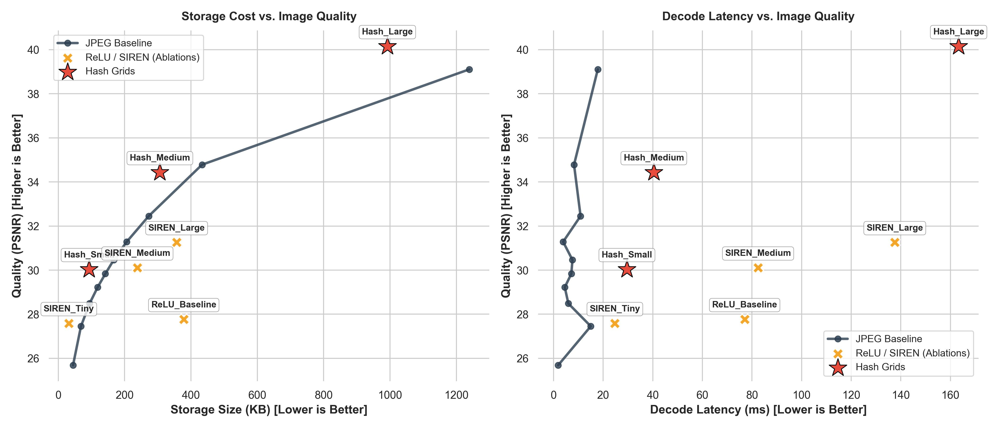

# Implicit Neural Compression Comparison

This project investigates a simple question:

**How does neural image compression compare with conventional image compression, and is trading storage for compute actually worth it?**

Instead of storing an image directly as pixels, I represent it using an **Implicit Neural Representation (INR)**: a neural network learns

`(x,y) -> (r,g,b)`

and the trained network weights become the stored representation of the image.

I compare three neural approaches against JPEG:

* **ReLU MLP**
* **SIREN**
* **Multi-Resolution Hash Grid**

The goal was to compare the trade-off between **storage size, reconstruction quality and decoding cost**.

---

## Project Context

This was developed as an individual mini-project for **COMP4528 Computer Vision at the Australian National University**.

The assignment had a fun constraint: the entire project had to use **only one provided image** for any research.

The supplied image was originally **5616 × 3744 RGB**. For the experiments it was downscaled by a factor of four to:

**1404 × 936 RGB**

This made training the coordinate-based neural models computationally practical.

Because the assignment explicitly restricted the dataset to one image, these results should be read as a **single-image comparison**, not as evidence that neural compression universally outperforms JPEG.

(Note that the original image hasn't been included as it is copyrighted but the script works with any image)

---

## What Was Compared?

For each method I measured:

* **Compressed Size (KB)** — how much storage the final representation required
* **PSNR** — pixel-level reconstruction quality
* **SSIM** — structural similarity
* **LPIPS** — perceptual similarity
* **Decode Latency** — how long reconstruction took

For the neural models, trained parameters were converted to **FP16** and compressed using **LZMA** before measuring storage size.

---

## Results

| Method        | Size (KB) ↓ |    PSNR ↑ |    SSIM ↑ |   LPIPS ↓ | Decode (ms) ↓ |
| ------------- | ----------: | --------: | --------: | --------: | ------------: |
| JPEG Q10      |       44.50 |     25.69 |     0.631 |     0.572 |          1.83 |
| JPEG Q20      |       68.45 |     27.45 |     0.691 |     0.479 |         14.99 |
| JPEG Q30      |       94.47 |     28.49 |     0.733 |     0.386 |          5.95 |
| JPEG Q40      |      118.64 |     29.22 |     0.763 |     0.336 |          4.51 |
| JPEG Q50      |      141.93 |     29.84 |     0.785 |     0.301 |          7.15 |
| JPEG Q60      |      167.21 |     30.46 |     0.805 |     0.270 |          7.61 |
| JPEG Q70      |      206.28 |     31.29 |     0.831 |     0.233 |          3.84 |
| JPEG Q80      |      272.78 |     32.45 |     0.865 |     0.179 |         10.88 |
| JPEG Q90      |      433.36 |     34.78 |     0.923 |     0.091 |          8.24 |
| JPEG Q100     |     1238.94 |     39.10 | **0.981** | **0.012** |         17.83 |
| ReLU Baseline |      378.22 |     27.77 |     0.773 |     0.502 |         77.04 |
| SIREN Tiny    |   **31.77** |     27.59 |     0.770 |     0.503 |         24.71 |
| SIREN Medium  |      238.46 |     30.11 |     0.844 |     0.366 |         82.44 |
| SIREN Large   |      356.81 |     31.26 |     0.842 |     0.330 |        137.57 |
| Hash Small    |       92.95 |     30.03 |     0.840 |     0.419 |         29.58 |
| Hash Medium   |      306.29 |     34.43 |     0.913 |     0.304 |         40.41 |
| Hash Large    |      992.06 | **40.15** |     0.961 |     0.185 |        163.31 |

### Main takeaway

The results show that neural compression can give interesting **storage-quality advantages**, but those advantages come at a significant computational cost.

For example:

* **SIREN Tiny** achieved 27.59 dB using only **31.77 KB**, compared with JPEG Q10 at 25.69 dB using 44.50 KB.
* **Hash Large** achieved the highest PSNR at **40.15 dB using 992 KB**, compared with JPEG Q100 at 39.10 dB using 1239 KB.
* However, Hash Large took around **163 ms to decode**, while JPEG Q100 took around **18 ms**.

So the interesting question is not simply whether neural compression is better.

It is whether **saving storage is worth spending more computation during reconstruction**.

---

## Pareto Plots

The left plot compares **storage size vs Image reconstruction quality**, while the right compares **Decode latency vs Image reconstruction quality**.

Together they show the central trade-off: neural representations can move toward better storage efficiency, but decoding becomes considerably more expensive.

---

## Files

### `01_baseline_jpeg.ipynb`

Runs the **standard JPEG baseline**.

It downsamples the original image, compresses it at JPEG quality levels from **Q10 to Q100**, measures the resulting file size and decode time, then evaluates each reconstruction using PSNR, SSIM and LPIPS.

This is the reference curve the neural methods are compared against.

---

### `02_neural_compression.ipynb`

Implements and evaluates the **ReLU MLP and SIREN models**.

The image is converted into coordinate/RGB pairs, so the models learn:

`(x, y) -> (r, g, b)`

The ReLU model uses positional encoding, while SIREN learns directly from the raw coordinates using sinusoidal activations.

The script trains several model sizes, reconstructs the image, measures decode latency, converts the learned weights to FP16, compresses them with LZMA and logs the final quality/storage results.

---

### `03_HashGridNGP.ipynb`

Implements the **multi-resolution Hash Grid** model.

Coordinates are encoded using learned feature grids at several resolutions, with larger grids using spatial hashing to keep the representation compact. The resulting features are decoded into RGB values using a small MLP.

This script trains the **Hash Small, Medium and Large** variants, reconstructs the image, compresses their FP16 weights with LZMA and records the final metrics.

---

### `04_evaluvation_and_graphs.ipynb`

Generates the final comparison plots from the saved CSV results.

It combines the JPEG, ReLU/SIREN and Hash Grid experiments and produces two main plots:

- **Storage Size vs PSNR**
- **Decode Latency vs PSNR**

These are the main visual summary of the storage-vs-compute trade-off explored in the project.

---

### `utils.py`

Contains the shared evaluation tools used by the experiment scripts.

It calculates **PSNR, SSIM and LPIPS**, along with an experimental correlation metric I tried during development, and includes a helper for visually comparing reconstructions and displaying an error heatmap.

## Limitations

The biggest limitation is the original assignment constraint: **only one image could be used**.

The neural experiments also use single training runs rather than repeated runs across multiple random seeds.

A natural extension would be to:

- evaluate the same models across multiple images and random seeds
- compare against newer codecs such as AVIF, WebP and JPEG XL
- run a broader configuration sweep to understand how architecture size, hash-grid resolution, feature dimensions and training settings affect the storage-quality trade-off